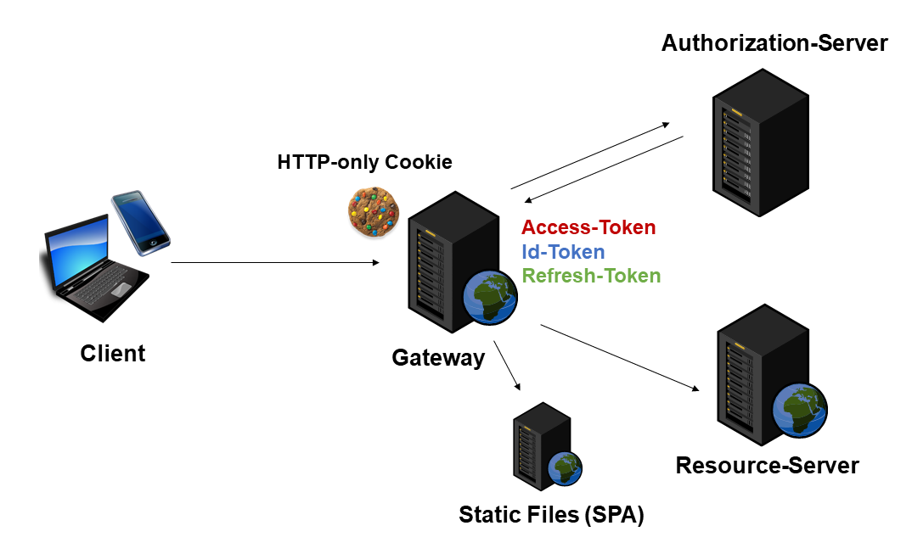

# Proof of Concept for an Auth Gateway

_... aka Auth Reverse Proxy ... aka Backend for Frontend (BFF) ... aka Forward Authentication Service_ ...

> Shift the use of security standards such as OAuth2 and OpenId Connect to the server side. This drastically simplifies the implementation of the SPA and makes your solution more secure.

## 🔥 Features

- ☑️ Easily implementing Authentication, Authorization, and SSO for SPAs (e. g. Angular) by making this gateway taking care of the heavy lifting on the serve side
  
- ☑️ Tokens (id_token, access_token, refresh_token) are only stored on server-side in order to increase security

- ☑️ Opaque handling of XSRF tokens. Angular apps will use them automatically.

- ☑️ ``login``, ``logout``, and ``userinfo`` endpoints for SPA

- ☑️ Lots of further features by leveraging Microsoft's YARP Reverse Proxy (e. g. Loading Balancing, Health Checks, Distributed Tracing)

- ☑️ Configuration via ``appsettings.json``

- ☑️ Prepared for the upcoming OAuth 2.1
  

## ⚡️ Live-Demo

see https://demo-auth-gateway.azurewebsites.net

### Demo-Client

The used demo client literally doesn't do a thing regarding security. It relays on the gateway and assumes that the gateway provides the following local paths:

- ``/login:`` (Re)login the user
- ``/logout:`` Logout the user
- ``/userinfo:`` Get info about the user as a JSON document (e. g. ``given_name``)
- ``/api:`` Assess to the API. The gateway forwards the ``access_token``

Please find the source code of the demo client here:

https://github.com/manfredsteyer/auth-gateway-client

## Running the Auth Gateway Locally

1. Get [.NET 6](https://dotnet.microsoft.com/download/dotnet/6.0) for Windows, Linux, or Mac
2. Call ``dotnet restore`` in the project's root to download all libs
3. Call ``dotnet run`` in the project's root to start the reverse proxy
4. Call the Demo App via http://localhost:5123 (please find the actual used port number on the console)

Also, have a look into the ``appsettings.json``.

## Further Readings

### YARP

This implementation uses [Microsoft's YARP](https://microsoft.github.io/reverse-proxy/articles/getting-started.html) (Yet Another Reverse Proxy). 

And the good message is: YARP can do so much more. Load balancing, health checking, and distributed tracing are just some examples.

### OAuth 2.0 for Browser-Based Apps

The OAuth 2 working group is current working on a best practices document called [OAuth 2.0 for Browser-Based Apps](https://datatracker.ietf.org/doc/html/draft-ietf-oauth-browser-based-apps-08). It will very likely be incorporated in the upcoming OAuth 2.1 standard and proposes the use of auth gateways (they call it "backend for frontend" or BFF) like this here.